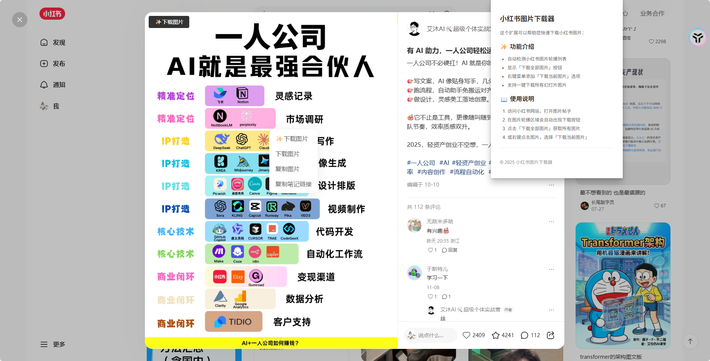
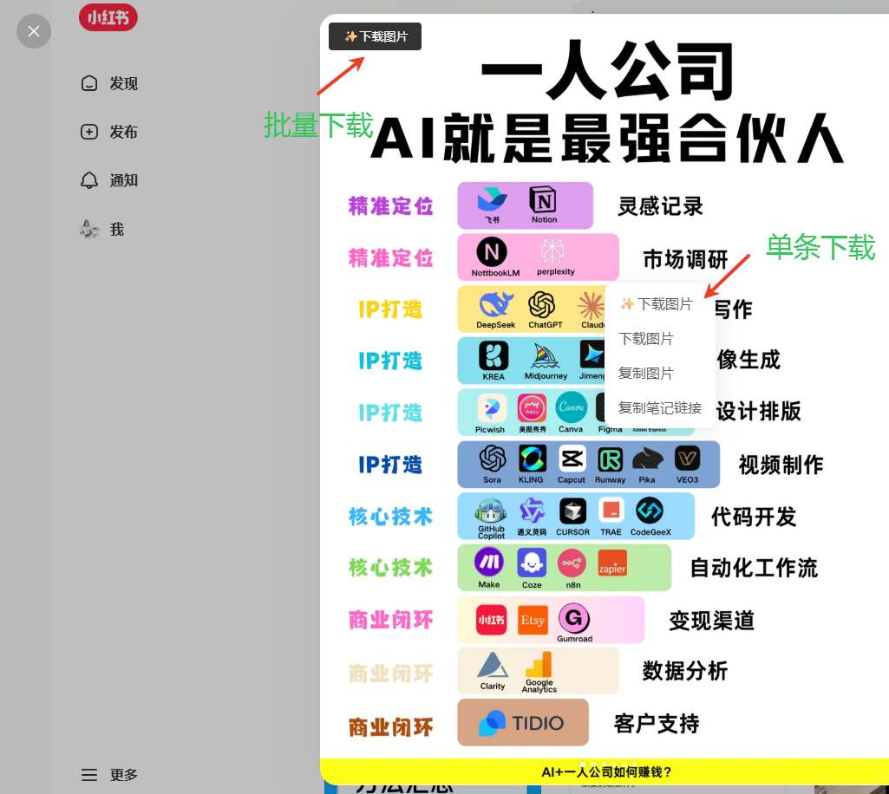

# 小红书图片下载扩展 (Xhs Download)

一个用于小红书网站的浏览器扩展，可以方便地下载帖子中的图片，支持去水印功能。

## 功能特性

- 📥 **批量下载**：一键下载当前帖子中的所有图片
- 🎨 **优化图片质量**：通过处理URL参数提高图片质量并尝试去除水印
- 📝 **智能命名**：根据帖子标题自动命名下载的图片文件
- 🔄 **重复检测**：避免重复下载相同的图片
- 💬 **友好提示**：下载状态通过Toast提示清晰显示
- 🔒 **安全可靠**：仅在小红书页面运行，保护用户隐私

## 支持的网站

- `https://www.xiaohongshu.com` - 小红书页面

## 安装方法

### 开发版本

1. 克隆或下载本项目
2. 在项目根目录执行以下命令安装依赖：
   ```bash
   pnpm install
   # 或
   npm install
   ```
3. 构建扩展：
   ```bash
   pnpm build
   # 或
   npm run build
   ```
4. 在浏览器中打开扩展管理页面（如Chrome的 `chrome://extensions/`）
5. 开启"开发者模式"
6. 点击"加载已解压的扩展程序"
7. 选择项目中的 `build/chrome-mv3-prod` 目录

### 生产版本

待发布到Chrome Web Store后，可直接从商店安装。

## 使用方法

1. 访问小红书探索页面 `https://www.xiaohongshu.com/explore`
2. 浏览帖子，找到包含图片的帖子
3. 在图片轮播区域（swiper）左上角会出现"✨下载图片"按钮
4. 点击按钮即可自动下载当前帖子中的所有图片
5. 支持右键菜单下载：在图片上右键点击，选择"✨下载图片"选项

## 界面预览




## 技术栈

- [Plasmo](https://docs.plasmo.com/) - 浏览器扩展开发框架
- TypeScript - 类型安全的JavaScript超集
- Chrome Extensions API - 浏览器扩展开发接口

## 项目结构

```
10-xhs-download/
├── assets/            # 扩展图标等资源
├── background.ts      # 扩展后台脚本
├── content.ts         # 内容脚本（在网页中运行）
├── popup.tsx          # 扩展弹窗组件
├── package.json       # 项目配置和依赖
└── README.md          # 项目说明文档
```

## 开发指南

### 启动开发服务器

```bash
pnpm dev
# 或
npm run dev
```

开发服务器启动后，会自动构建扩展并生成开发版本。在浏览器中加载 `build/chrome-mv3-dev` 目录即可进行开发测试。

### 构建生产版本

```bash
pnpm build
# 或
npm run build
```

构建完成后，生产版本会输出到 `build/chrome-mv3-prod` 目录。

### 代码规范

项目使用Prettier进行代码格式化，请确保在提交代码前运行格式化命令：

```bash
pnpm format
# 或
npm run format
```

## 更新日志

- **v0.0.1**：初始版本
  - 实现批量下载图片功能
  - 支持自动去水印
  - 添加重复下载检测
  - 实现Toast提示功能

## 注意事项

1. 本扩展仅用于个人学习和研究目的
2. 请尊重图片版权，不要将下载的图片用于商业用途
3. 使用过程中请遵守小红书的用户协议

## 贡献

欢迎提交Issue和Pull Request来帮助改进这个扩展！

## 许可证

MIT License
